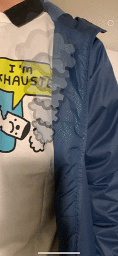

# Animated T-Shirt Experiment

This is a simple ARKit app based on the "Detecting Images in an AR Experience" example from Apple, that adds an animation to zoë bread's [the exhausted pipe](https://www.zoebread.com/product/the-exhausted-pipe) t-shirt.

This repository also contains a Swift Playground that can be run on an iPad with Swift Playgrounds installed (Swift 5.7).

## Example

